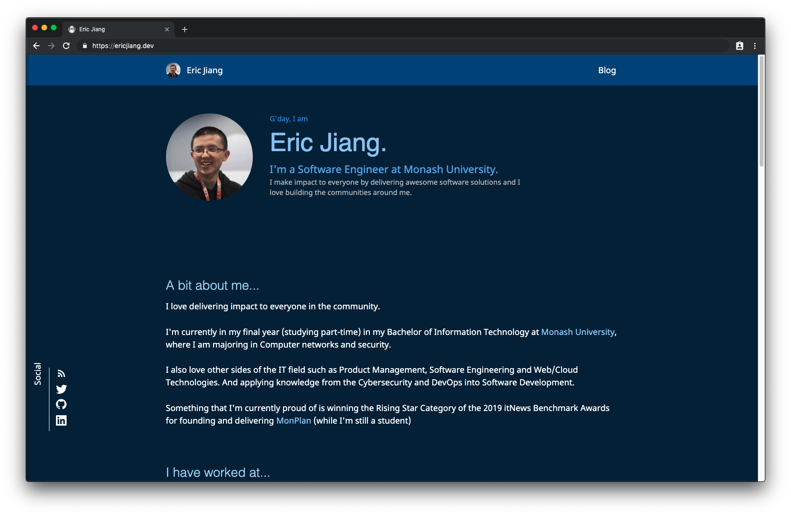

# lorderikir.me Personal Website

My personal site at [ericjiang.dev](https://ericjiang.dev) is based off the [Gatsby Starter Egghead Blog](https://github.com/eggheadio/gatsby-starter-egghead-blog)
A starter project in [Gatsby.js](https://www.gatsbyjs.org/) with [MDX](https://github.com/mdx-js/mdx).

# Links

**Production**: [https://ericjiang.dev](https://ericjiang.dev)

**Staging/Preview**: [https://staging.ericjiang.dev](https://staging.ericjiang.dev)

## Build Statuses: 

### Production

[](https://app.netlify.com/sites/lorderikir/deploys)

# Development

## Requirements

- Node & NPM
- Yarn (recommended)
- NVM (recommended)

## Getting Started

1. Clone this repository locally

   ```bash
   git clone https://github.com/ericjiang97/ericjiang.dev.git

   # or if you are using SSH

   git clone git@github.com:ericjiang97/ericjiang.dev.git
   ```

2. Go into current directory `cd lorderikir.me`
3. Install required Node dependencies

   ```bash
   npm install

   # or if you prefer yarn

   yarn
   ```

4. Start the local development server

   ```bash
   npm run develop

   # or if you prefer yarn

   yarn develop
   ```

# LICENSE

See [LICENSE](./LICENSE)
