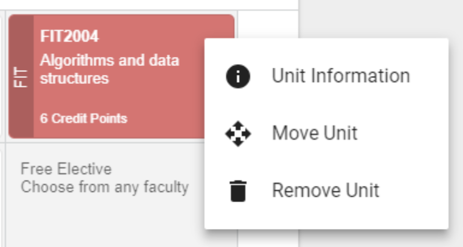

We all know that making apps is hard, but making the app easier to use is even harder — especially when you are working on it everyday it’s hard to gauge whether or not something is more easier to use. But, throughout the lifecycle of MonPlan, we have iteratively improved the design of our app to make it easier to use and look more ‘pretty’ to the eye.

## More consistent design — similar looks have similar meanings.

This is quite straightforward, making your design more consistent throughout the app by following design principles. But components within the apps **should** have the same meaning.

Within our older unit cards, no-one understood what the colours meant, the full greyed out stated meant that a unit error has been breached. With the newer changes we broke the card down into 3 sections:

- Faculty (Coded with 3–4 letters) with it’s faculty colour,
- the main body describing the most important info: Unit Code, Unit Name and the amount of credit points
- And the new action menu which is a dropdown — triggered by the extra icon. Allowed us to add making it easier to drag-n-drop the card or allowing select-n-drop in mobile. By also moving our delete, view unit information and move units, we not managed to make it mobile friendly, but also ensuring that we met WCAG AA 2.1 Accessibility Standards. It also meant that we prevent some dangerous actions too — at least we can prevent errors.

We also applied this principle to our teaching periods after successfully testing the card principle out there in the wild, the change was made around mid-2018. This also gave us the ability to add more user actions to the teaching periods such as marking periods as intermissions or going on exchange.

By moving key actions into a dropdown, we firstly can prevent users from making ‘dangerous’ actions, such as overloading, removing the teaching period and other key actions, but also make it more mobile accessible.

## Displaying what is necessary to the user
Something that recently that has been worked on is the validation modal.

The problem here is that how do we are making it easier for the user to understand what rules they have breached and how to resolve it.
We are also presenting unnecessary information to the user, but also making it hard to understand.

When the user first looks at this modal — they are bombarded with information, and there’s no summary.

First, lets do the following things:
- Add a summary box, that describes what rules are we comparing against
- Remove the expansion panels (as expansion panels within expansion panels is not as ‘clean’ and also makes it hard to understand what is going on.
- Hide all the rules which have passed inside the details section as it is ‘unnecessary’ information.

So lets break up the details even further…we’ll break down the unit rules into different ‘cards’, which makes the grouping even cleaner and also change the language so that it’s more positive so from ‘Errors’ into ‘Requirements’.

So we’ve added back the expansion panels as the user can choose to read them or not, they can expand and hide as their wish.

We eventually moved away from the ‘Paper’ design to group the errors, into a singular box, with a dashed border to help group the elements.

---
Throughout the iterative release cycle, we have built up various concepts and tried and tested out concepts in the wild under user testing sessions.
And remember to keep your users first, without your users your application will go nowhere.