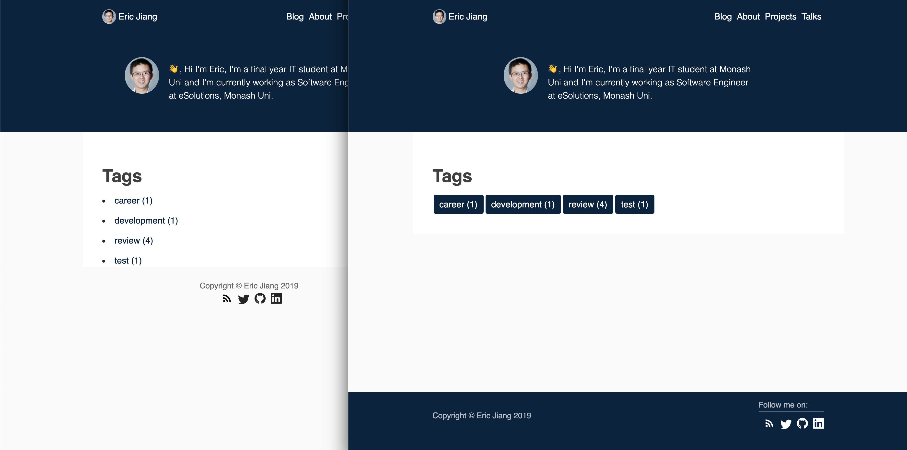
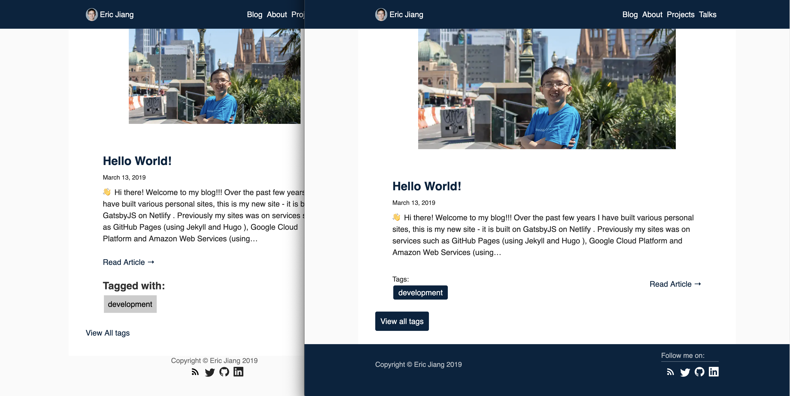
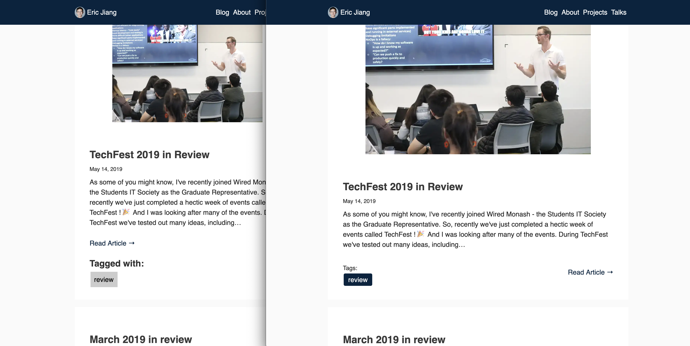

There comes a time when I'm extremely bored and having nothing to do after a long day of exam study and I have time to dedicate to making my personal website more pretty.

# Upgrades

The first upgrade happened a few days ago, where I introduced tags into the blog. This allows me to tag my blog posts and additionally allows my blog posts to become more searchable.

Following that posts have tags in them, and going to the all tags page allows for you to see posts by tag too!

# Site Redesign

The second upgrade happened yesterday, where I changed the primary color of my personal website to a dark colour - this change is shown above in the banner.

The footer has also changed to become a much more compact size and as it uses flexboxes it is responsive to the device size too!

I will also be rolling out additional upgrades over the coming days & weeks, as well as adding more blog content too!
